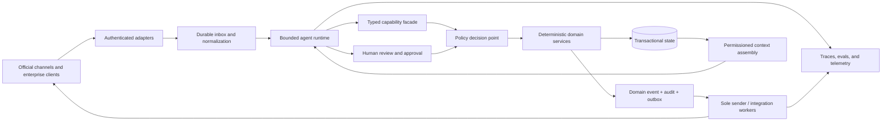

# Reference Architecture

**Status:** Strategic architecture; repository contracts remain normative  
**Proposed owner:** Principal Engineering  
**Architecture horizon:** Reference vertical through enterprise platform

## Architectural objective

Create a platform in which probabilistic interpretation can improve rapidly while business authority, tenant isolation, auditability, and effects remain stable and testable.

The key separation is:

> The model proposes. Deterministic policy decides. Transactional services commit. The outbox delivers. Evidence proves what occurred.

## Logical system

The diagram is conceptual. Exact repository contracts, schemas, and release gates control implementation.

## Four planes

### Runtime plane

Receives normalized work, constructs the bounded context packet, invokes the model, validates structured outputs, calls typed tools, and terminates within configured budgets. It does not hold channel credentials or bypass policy/domain services.

### Execution plane

Owns authoritative state, money, policy, permissions, SLA, state machines, idempotency, approvals, domain events, audit records, and outbox creation. It is deterministic and independently testable.

### Governance plane

Owns tenant identity, roles, policy publication, capability manifests, consent/suppression, provider configuration, data lifecycle, release gates, and audit access.

### Improvement plane

Owns versioned datasets, trace redaction, offline evaluation, shadow comparisons, experiment assignment, error taxonomy, model/harness promotion, and regression prevention.

No plane may silently assume another plane's authority. Cross-plane inputs are typed and versioned.

## Request-to-effect lifecycle

1. An official adapter authenticates the source and persists an immutable inbound envelope.
2. Normalization maps channel data to tenant-scoped typed input while retaining provenance.
3. The runtime receives a work item through a durable queue and builds a context packet.
4. Deterministic routing selects direct code, shallow agent, human workflow, or approved deep analysis.
5. The model emits a schema-bound proposal or typed tool request.
6. The facade validates shape, capability, tenant, actor, resource scope, and freshness.
7. The policy decision point returns allow, deny, require approval, require human, or not supported.
8. A domain service atomically applies a valid mutation and writes its event, audit, and outbox record.
9. The sole sender performs an approved external effect with idempotency and records the result.
10. Redacted telemetry links input, versions, decisions, tool results, effect, and outcome.

At-least-once delivery is assumed. “Effect once” is achieved through durable idempotency, deduplication, and reconciliation; it is not claimed from transport exactly-once semantics.

## Deterministic routing tiers

| Tier | Use | Example | Model involvement |
| --- | --- | --- | --- |
| Direct | Structured request, deterministic answer/action | Fetch known order status | None or presentation only |
| Shallow | Ambiguous language with a short bounded workflow | Interpret request and propose valid next action | One bounded concierge |
| Human | Material ambiguity, permission, novel exception, or required approval | Unresolved compensation policy | Draft/context only |
| Deep | Independent research or broad synthesis outside live customer effects | Pack discovery or incident evidence review | Optional specialist agents in isolation |

Routing is code and policy, not a model self-assessment. Deep or multi-agent work cannot acquire greater effect authority than the caller.

## Stable boundaries

The following interfaces should remain stable while models and frameworks change:

- `InboundEnvelope`: authenticated source, tenant, actor, timestamps, correlation, payload reference, consent metadata.
- `AgentWorkItem`: workflow, capability set, context reference, budgets, runtime/prompt/model/config versions.
- `ToolRequest` / `ToolResult`: discriminated, versioned schemas with purpose and resource scope.
- `PolicyDecision`: decision, reason code, policy version, obligations, approval requirement.
- `DomainCommand` / `DomainEvent`: expected version, idempotency key, actor, causal chain, typed payload.
- `ApprovalRequest`: proposed effect, materiality, evidence summary, expiry, approver policy.
- `OutboxEffect`: destination adapter, template/payload reference, consent state, idempotency, retry policy.
- `TraceEnvelope`: redacted spans, versions, outcomes, errors, cost, and evaluation linkage.

Payload definitions belong in normative contracts before implementation.

## Runtime invariants

- One customer-path concierge with a small, task-oriented capability surface.
- Configured ceilings for model calls, tool calls, time, tokens, cost, retries, and repeated-action loops.
- No generic shell, browser, arbitrary HTTP, database, messaging, code execution, or raw secret tool.
- No model-selected tenant, account, order, policy, pricebook, template, or destination identifier without server-side binding and validation.
- No direct send. All external messages/effects are outbox-mediated and policy checked.
- STOP, suppression, consent, quiet hours, permissions, and material approvals are deterministic.
- Context and tool results are untrusted data, not instructions.
- No chain-of-thought persistence. Store decisions, reason codes, concise summaries, and evidence references.
- Unknown policy or stale authority fails closed.

## Transaction and event model

Each material mutation uses one database transaction to:

1. Validate tenant, identity, permission, policy version, and expected aggregate version.
2. Apply the domain state transition.
3. Append the domain event.
4. Append the audit event.
5. Insert any required outbox record.

The commit succeeds or fails as one unit. External delivery happens after commit. Consumers are idempotent and replay-safe. Reconciliation detects effects whose external outcome is unknown.

## Human control

Human review is a first-class durable state, not an exception hidden in a prompt. An approval record includes the exact proposed effect, immutable supporting snapshot, requester, policy, materiality, allowed approvers, expiry, decision, and resulting command. Editing a proposal creates a new version and invalidates the old approval.

## Platform topology

The near-term deployment is a modular monolith plus isolated workers and one PostgreSQL authority, because it preserves transactional semantics and operational simplicity. Split services only at measured boundaries such as channel delivery, high-volume document processing, evaluation workloads, or tenant deployment isolation.

Recommended evolution:

- **Reference stage:** local/private modular deployment, one tenant, shadow/internal paths.
- **Lighthouse stage:** dedicated tenant environment, managed database, official adapters, private observability.
- **Enterprise stage:** dedicated trust cell with customer identity, keys, policies, retention, audit export, and controlled connectors.
- **Shared SaaS stage:** only after automated isolation tests, per-tenant encryption/quotas, noisy-neighbor controls, incident exercises, and economic proof.

Kubernetes, GPUs, a service mesh, a vector database, or a workflow engine are capacity/risk responses—not markers of product maturity.

## Build, buy, and defer

| Capability | Direction | Rationale |
| --- | --- | --- |
| Domain state/policy/effects | Build | Core authority and differentiator |
| Agent harness and facade | Build thin boundary | Enables provider portability and repository invariants |
| Frontier models | Buy behind adapter | Model training is not the initial moat |
| PostgreSQL/outbox | Use proven infrastructure | Strong transaction and operational fit |
| Identity, key management, telemetry primitives | Buy/integrate | Commodity controls with enterprise ecosystems |
| Vertical ontology/policy/evals | Build with design partners | Compounding domain advantage |
| Generic multi-agent framework | Defer | Adds coordination and failure surface without proven need |
| GPU/on-prem serving | Partner/defer | Introduce only for measured latency, sovereignty, or economics |
| Durable workflow engine | Trigger-based adoption | Add when long-lived workflow volume/complexity exceeds current state machine |

## Architecture fitness functions

Every release should be able to demonstrate:

- Forbidden effects cannot be reached through alternate paths.
- A tenant-scoped actor cannot access another tenant under positive and negative tests.
- Replay does not duplicate a material effect.
- Model/provider/prompt/tool changes are attributable and rollbackable.
- Policy changes are versioned and old decisions remain explainable.
- A worker crash resumes or safely reconciles the workflow.
- Public capability remains unavailable without its signed gate.
- The same evaluation envelope can compare runtime implementations.

## Explicit non-goals

- Runtime framework lock-in.
- Autonomous policy creation.
- Unbounded planning loops.
- Shared long-term model memory as business truth.
- Eventual consistency for mutations whose domain invariants require one transaction.
- A single global agent identity or credential.
- Cross-tenant learning from raw content without an explicit lawful, contractual, and technical path.
